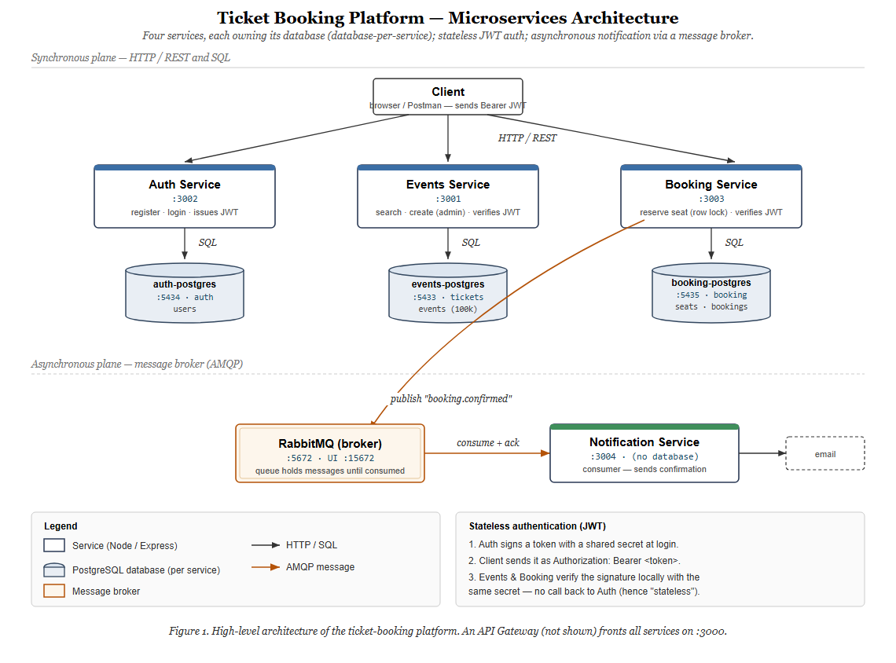

# Ticket Booking Platform

An **event-driven microservices backend** for booking event tickets, built to practice
real-world backend system design — database performance, security, concurrency control,
asynchronous messaging, and an API gateway.

> Learning-focused but production-shaped: 5 services, a database per service, a message
> broker, JWT auth, and a hand-built API gateway — all orchestrated with Docker Compose.

---

## Architecture



*An API Gateway (`:3000`) fronts all services. Auth issues a JWT (shared secret) → Events
& Booking verify it locally (stateless). Each service owns its own database
(database-per-service / low coupling). Booking publishes `booking.confirmed` to RabbitMQ;
Notification consumes it asynchronously.*

<details><summary>Text version (ASCII)</summary>

```
                         ┌──────────────────────────┐
        client  ───────► │   API Gateway  :3000     │   reverse proxy + rate limiting
                         └───────────┬──────────────┘
            ┌────────────────────────┼────────────────────────┐
            ▼                        ▼                         ▼
     ┌────────────┐          ┌────────────┐            ┌────────────┐
     │   Auth     │          │   Events   │            │  Booking   │
     │   :3002    │          │   :3001    │            │   :3003    │
     └─────┬──────┘          └─────┬──────┘            └─────┬──────┘
           ▼                       ▼                         ▼     │ publish
      auth-postgres          events-postgres           booking-postgres
        (users)              (events, 100k)            (seats, bookings)
                                                              │
                                                              ▼
                                                   ┌────────────────────┐
                                                   │   RabbitMQ broker  │
                                                   └─────────┬──────────┘
                                                             ▼ consume
                                                    ┌──────────────────┐
                                                    │  Notification    │ → ✉ email
                                                    │     :3004        │
                                                    └──────────────────┘
```
</details>

## Tech stack
- **TypeScript + Node.js** (Express)
- **PostgreSQL** — one database per service
- **RabbitMQ** — message broker (event-driven, async)
- **JWT** (`jsonwebtoken`) + **bcrypt** for auth
- **Docker Compose** for local orchestration
- Hand-built **API Gateway** (`http-proxy-middleware` + `express-rate-limit`)

## Services
| Component | Port | Role |
|---|---|---|
| `gateway` | 3000 | Single entry point — reverse-proxy routing + central rate limiting |
| `events` | 3001 | Event catalogue: search/list/create (admin). 100k seeded rows. |
| `auth` | 3002 | Register / login, issues JWTs, bcrypt password hashing |
| `booking` | 3003 | Seat reservation with concurrency-safe locking; publishes events |
| `notification` | 3004 | Consumes `booking.confirmed`, "sends" confirmation (no DB) |
| `rabbitmq` | 5672 / UI 15672 | Message broker |
| Postgres ×3 | 5433 / 5434 / 5435 | One per service (events / auth / booking) |

---

## What this project demonstrates

### Database performance — indexing & query planning
Seeded the events table to **100,000 rows**, then optimised the search query:
- Diagnosed a slow query with `EXPLAIN ANALYZE` → a **sequential scan** examining all
  100k rows (98% discarded by filter).
- Added a **composite index** on `(city, category, event_date)`.
- Result: **~14 ms → ~3 ms**, `Seq Scan` → `Bitmap Index Scan` — O(n) → ~O(log n).
- Learned the **leftmost-prefix rule** (why a `(city, category, date)` index helps
  `city`-led queries but not `category`-only ones).

### Authentication & security
- **bcrypt** password hashing (salted, deliberately slow) — never plaintext.
- **Stateless JWT auth**: auth signs tokens; events/booking verify them **locally**
  with a shared secret — no shared session store, no call back to auth.
- **Role-based access control** (`requireAuth` + `requireAdmin`) — only admins create events.
- OWASP touches: parameterised queries (SQL-injection safe), no user-enumeration on
  login, no client-controlled `role` (mass-assignment), rate limiting.

### Concurrency control — the overselling problem
The centrepiece:
- Built seat reservation **naively** (check-then-act) and **reproduced overselling** with
  a concurrent load script — 10 simultaneous requests booked **one seat 8 times**.
- Fixed it with a **database transaction + pessimistic row lock** (`SELECT … FOR UPDATE`),
  so the check-and-book is atomic. After the fix: exactly **1 success, 9 rejected**.

### Event-driven architecture
- Booking **publishes** `booking.confirmed` to RabbitMQ and responds immediately —
  it doesn't block on side-effects (e.g. sending email).
- Notification **consumes** the queue independently.
- **Decoupled** (booking doesn't know notification exists) and **resilient** (messages
  wait safely in the queue if the consumer is down; delivered when it returns).

### API Gateway
- A single front door (`:3000`) reverse-proxies `/auth`, `/events`, `/bookings` to the
  right internal service — clients never touch internal ports.
- **Central rate limiting** (100 req/IP/min → `429`) protects every service at once.

---

## Getting started

### Prerequisites
- [Docker Desktop](https://www.docker.com/products/docker-desktop/)
- (Optional) Node 20+ for IDE tooling / running services outside Docker

### Run everything
```bash
docker compose up --build
```
This starts the gateway, all services, three Postgres instances, and RabbitMQ.

### Try it (all through the gateway on :3000)
```bash
# register + login
curl -X POST http://localhost:3000/auth/register -H "Content-Type: application/json" \
  -d '{"email":"me@example.com","password":"supersecret123"}'

curl -X POST http://localhost:3000/auth/login -H "Content-Type: application/json" \
  -d '{"email":"me@example.com","password":"supersecret123"}'
# → { "token": "eyJ..." }

# search events (public)
curl "http://localhost:3000/events?city=Athens&category=concert"

# reserve a seat (needs the token)
curl -X POST http://localhost:3000/bookings -H "Content-Type: application/json" \
  -H "Authorization: Bearer <token>" -d '{"seat_id":"1","event_id":"1"}'
```

- **RabbitMQ management UI:** http://localhost:15672 (guest / guest)

---

## Design decisions & trade-offs
- **Database per service** — each service owns its data for low coupling and independent
  evolution, at the cost of no cross-service foreign keys (references are by id, validated
  in app code / via messaging). Avoids the "distributed monolith" trap.
- **Pessimistic locking for seats** — seats are unique, contested resources, so
  `SELECT … FOR UPDATE` (lock upfront) beats optimistic locking (which would reject the
  loser only at the end of checkout — poor UX). Matches how real ticketing systems work.
- **Stateless JWT** — services verify tokens locally, so identity scales without a shared
  session store; trade-off is tokens can't be easily revoked before expiry.
- **API Gateway** — centralises routing, rate limiting, and (optionally) auth, at the cost
  of being a single point of failure (mitigated in production by running multiple instances).

## How it was built (phases)
0. Foundations — Docker + Postgres + one service
1. Events service — REST, layered architecture, **indexing & EXPLAIN ANALYZE**
2. Auth & security — **JWT, bcrypt, RBAC, OWASP**
3. Booking — **concurrency, transactions, pessimistic locking**
4. Message broker — **RabbitMQ, producer/consumer, async**
5. API Gateway — **reverse proxy, rate limiting**
6. Integration & docs

> Built as a structured, hands-on study of backend system design — feeling each problem
> (slow query, overselling, blocking I/O) before applying the textbook solution.
